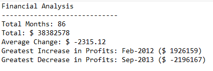
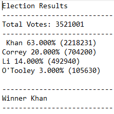

# Python Challenge

## PyBank

* Created a Python script that analyzes the financial records of a company to calculate each of the following:

  * The total number of months included in the dataset

  * The net total amount of "Profit/Losses" over the entire period

  * Calculate the changes in "Profit/Losses" over the entire period, then find the average of those changes

  * The greatest increase in profits (date and amount) over the entire period

  * The greatest decrease in losses (date and amount) over the entire period

## PyPoll

* Created a Python script that analyzes the votes of a small town and calculates each of the following:

  * The total number of votes cast

  * A complete list of candidates who received votes

  * The percentage of votes each candidate won

  * The total number of votes each candidate won

  * The winner of the election based on popular vote.

## Challenges
  * Import csv modules to read and write files in various formats
  * Sorting data put into variables, lists, and dictionaries
  * Iterating through data structures
  * Debugging
